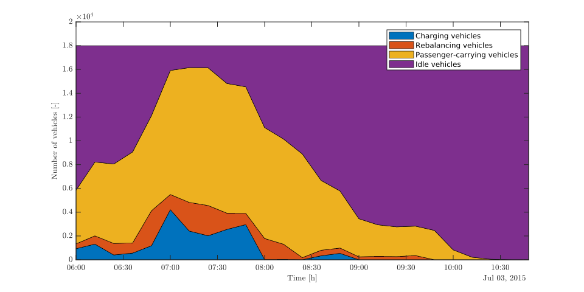

# AMoD-toolkit

A reference *MATLAB* implementation of the time-varying, charge-aware network flow model for electric AMoD systems described in Rossi et al. 2018. The code implements both the traditional and real-time formulations. However, it does not include the power network.

This code is based on the original implementation in [AMoD-power](https://github.com/StanfordASL/AMoD-power) with a number of changes:

* Completely reorganized code to improve reusability
* Minimized code duplication between the traditional and real-time implementations
* Reformulated the optimization problems to use YALMIP


## Getting Started

These instructions will get you a copy of the project up and running on your local machine for development and testing purposes.

### Prerequisites

The code relies on [YALMIP](https://yalmip.github.io/) to formulate and solve optimization problems. Before running the code make sure that YALMIP works and is able to solve linear programs (LPs) by running
```Matlab
yalmiptest
```
and verifying that the LP test passes. 

Small problems can be solved using free solvers like GLPK and SeDuMi. However, large-scale problems benefit from a commercial solver. In our experience,  Gurobi offers the best results, followed by MOSEK. Both offer free licenses for academia.


### Installing

Clone the AMoD-toolkit repository. 

If you want to use AMoD-toolkit from outside the folder where it resides, you need to add this folder to MATLAB's path with the command

```Matlab
addpath('path to AMoD-toolkit')
```
for example
```Matlab
addpath('~/Repos/AMoD-toolkit')
```
### Running the sample code

Once the installation is done, run [`aaSampleUseCase`](aaSampleUseCase.m). This code goes through the process of setting up and solving an electric AMoD problem. It also compares the traditional and real-time formulations (see below).

The sample code plots the activities of the vehicles across time. This is shown for the traditional formulation in the following image: 


Whereas, for the real-time formulation it is as follows:


The activities are similar in both cases but there are some small differences. In general, the real-time formulation offers shorter computation times at the cost of some suboptimality


## About the code
There are three main classes: [`EAMoDspec`](@EAMoDspec/EAMoDspec.m), [`EAMoDproblem`](@EAMoDproblem/EAMoDproblem.m) and [`EAMoDproblemRT`](@EAMoDproblemRT/EAMoDproblemRT.m).

###  EAMoDspec
`EAMoDspec` is used to specify the electric AMoD problem at hand. All public properties must be set for the problem to be fully specified. The method `ValidateSpec` can be used to check that all values are consistent with each other.

For more details, look at the comments in `EAMoDspec` and `EAMoDspecDemo.mat`

Note that `EAMoDspec` specifies *what* problem to solve but not *how* to solve it. Hence, relaxations and the configuration of the solver are specified in `AbstractEAMoDproblem`.

###  EAMoDproblem
`EAMoDproblem` implements the electric AMoD problem in the traditional formulation. It takes an `EAMoDspec` in the constructor which is copied into `EAMoDproblem.spec` and cannot be modified anymore. However, you can modify the `EAMoDspec` and then instantiate another `EAMoDproblem`.

###  EAMoDproblemRT
`EAMoDproblemRT` implements the electric AMoD problem in the real-time formulation. In this formulation, the customer-carrying vehicles are assumed to follow pre-computed routes and only the rebalancing vehicles are part of the optimization. The real-time formulation leads to smaller optimization problems that are faster to solve but this comes at the price of suboptimality. However, the solutions are often still of high quality.

###  AbstractEAMoDproblem
`AbstractEAMoDproblem` is the abstract base class of both `EAMoDproblem` and `EAMoDproblemRT`. It contains common functionality.

**Note on feasibility**
For the optimization problem to be feasible, the number of vehicles in the fleet must suffice to fulfill the customer trip requests. If this is not the case, it is often useful to relax the problem. This can be done by setting  `source_relax_flag` to true and `source_relax_cost` to a positive value (typically 1e6 to 1e8 works well). This allows the optimization to drop some trip requests for a cost. 


## Documentation
The code is commented in such a way that MATLAB's `help` and `doc` commands work for all files.

## Running the tests

The tests are located in the directory `Test/`. They can be run by setting this folder as MATLAB's current folder and executing `runtests`. Single tests can be run by executing `runtests('test_name')` (for example, `runtests('VehicleConservationTest')`) 

### Tests based on first principles
[`VehicleConservationTest`](Test/VehicleConservationTest.m) verifies that the number of vehicles remains constant across time.

### Regression tests
[`CompareWithAMoDpowerTest`](Test/CompareWithAMoDpowerTest.m) verifies that this code is consistent with AMoD-power. In particular, it verifies that the matrices for the LP are equal and that the value of the objective function at optimality is within a small tolerance.

To run this test, the folder with the AMoD-power repository must be in your MATLAB path. Furthermore, the same solver used in AMoD-power must be available for YALMIP (i.e., in the MATLAB path). At the time of writing, this is MOSEK's linprog overload. Thus, you need to modify the paths in `setupOnce` accordingly before running the test.

## Contributing

The development of AMoD-toolkit is based on Github Issues. Please create a new Issue to report a bug or request a new feature.

We use the feature branch workflow where Issue #xx is associated to branch Issues/xx. If you want to work on an issue, please do so on the corresponding branch. At the end, please create a pull request so that one of the core developers can review your code and fix any issues before merging to master.

### Style
* Variable names are generally lowercase (with some exceptions where uppercase is justified) and always separated with underscores
	* Names for variables with units have the unit at the end. For example, `time_step_s` which is given in seconds. Throughout the code, we use base units (meter instead of kilometer, joule instead of kilo-watt-hour, watt instead of kilo-watt and so on)
* Function and class names are written in CamelCase and start with uppercase
 

## Authors

* **Federico Rossi** - Implemented [AMoD-power](https://github.com/StanfordASL/AMoD-power) 
* **Alvaro Estandia** - Implemented AMoD-toolkit based on AMoD-power

## License

This project is licensed under the MIT License - see the [LICENSE.md](LICENSE.md) file for details

## Acknowledgments

* This README was adapted from [PurpleBooth's template](https://gist.github.com/PurpleBooth/109311bb0361f32d87a2)

## Citing AMoD-toolkit
If you use AMoD-toolkit for a scientific publication, please cite Rossi et al. 2018.

## References
F. Rossi, R. Iglesias, M. Alizadeh, and M. Pavone, “On the interaction between Autonomous Mobility-on-Demand systems and the power network: models and coordination algorithms,” in Robotics: Science and Systems, Pittsburgh, Pennsylvania, 2018.   [Download PDF](https://asl.stanford.edu/wp-content/papercite-data/pdf/Rossi.Iglesias.Alizadeh.Pavone.RSS18.pdf)
